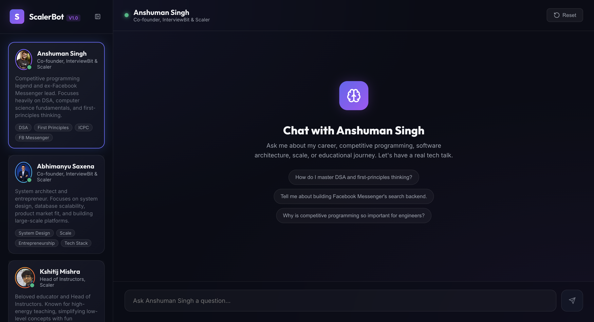

# Persona-Based AI Chatbot (Scaler Assignment 01)

Full-stack chat UI with three persona-specific system prompts (Anshuman Singh, Abhimanyu Saxena, Kshitij Mishra), streaming replies via OpenRouter, and a Vite + React frontend.

## Live demo

[Live Demo Link](https://scaler-persona-chatbot-beta.vercel.app/)
[Backend Link](https://scaler-persona-chatbot-backend.onrender.com)

## Screenshots




## Repo layout


| Path               | Purpose                                                                                                           |
| ------------------ | ----------------------------------------------------------------------------------------------------------------- |
| `frontend/`        | Vite + React + Tailwind UI                                                                                        |
| `backend/`         | Bun + Express API, OpenRouter client                                                                              |
| `backend/prompts/` | System prompts (source of truth)                                                                                  |
| `prompts.md`       | Same prompts + reviewer-facing annotations (**regenerate** if you edit `backend/prompts/index.ts`—see note below) |
| `reflection.md`    | Short write-up (assignment requirement)                                                                           |


## Prerequisites

- [Bun](https://bun.sh) (used for both apps here)
- OpenRouter account + API key

## Setup

### 1. Backend

```bash
cd backend
cp .env.example .env
# Set OPENROUTER_API_KEY in .env
bun install
bun run index.ts
```

API listens on **[http://localhost:3000](http://localhost:3000)** with chat at `/api/v1/chat`.

### 2. Frontend

```bash
cd frontend
cp .env.example .env
# Set VITE_BACKEND_API_URL to your API base including /api/v1, e.g.:
# VITE_BACKEND_API_URL=http://localhost:3000/api/v1
bun install
bun run dev
```

### Environment variables


| Variable               | Where           | Description                                                   |
| ---------------------- | --------------- | ------------------------------------------------------------- |
| `OPENROUTER_API_KEY`   | backend `.env`  | OpenRouter secret (never commit)                              |
| `VITE_BACKEND_API_URL` | frontend `.env` | Base URL for chat routes, e.g. `http://localhost:3000/api/v1` |


Requests hit:

- `POST {VITE_BACKEND_API_URL}/chat` — send message (SSE stream)
- `PATCH {VITE_BACKEND_API_URL}/chat` — switch persona (resets server-side thread)

## Deploy notes

- Put `OPENROUTER_API_KEY` in the backend host’s secrets.
- Point `VITE_BACKEND_API_URL` at the **public** API base in production builds.
- Ensure CORS allows your frontend origin (see `backend/index.ts`).
